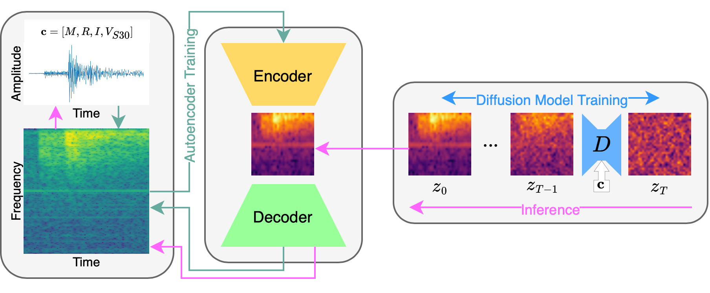

# This quake does not exist

[](https://github.com/highfem/tqdne/actions/workflows/ci.yml)
[](https://arxiv.org/abs/2410.19343)

> Generative modelling of seismic waveforms using denoising diffusion.
> 
> 

## About

This repository contains the experimental code of the manuscript [High Resolution Seismic Waveform Generation using Denoising Diffusion](https://arxiv.org/abs/2410.19343).
It can be used to generate seismic waveforms, replicate the results from the manuscript, or for training custom models from scratch.

## Installation

You can install all required dependencies and the versions that have been used in the experiments using `conda`.
First download the latest release of the model from [here](https://github.com/highfem/tqdne/releases). Then, install Python dependencies by creating a new `conda` environment, and by then activating it:

```bash
conda env create -f environment.yml -p <PATH>
conda activate tqdne
```

where `<PATH>` is a user defined path.

## Weight files

You can find the weight files for the neural networks on [Zenodo](https://zenodo.org/records/13952381), under the `weights` folder.

## Experiments

All experimental code can be found in `experiments` (which we, e.g., used to train the proposed generative models).

## Sampling waveforms

You can generate your own waveforms using the scripts in `scripts`.

## Acknowledgements

Some Python code has been adopted from the following sources:

- EDM: https://github.com/NVlabs/edm
- Consistency models: https://github.com/openai/consistency_models
