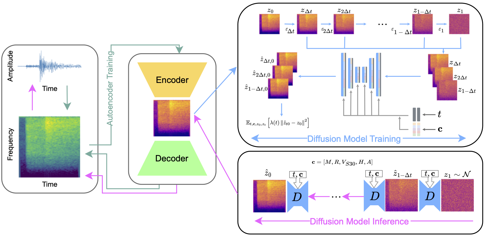

# This quake does not exist

[](https://github.com/highfem/tqdne/actions/workflows/ci.yml)
[](https://arxiv.org/abs/2410.19343)

> Generative modelling of seismic waveforms using denoising diffusion.
>
> 

## About

This repository contains the experimental code of the manuscript [High Resolution Seismic Waveform Generation using Denoising Diffusion](https://arxiv.org/abs/2410.19343).
It can be used to generate seismic waveforms, replicate the results from the manuscript, and for training custom models from scratch.

## Installation

If you are interested in reproducing the results from the paper, please refer to [`experiments/README.md`](experiments/README.md). Otherwise, you can install `tqdne` like this:

1.
   a) **Recommended**: Download the latest [release](https://github.com/highfem/tqdne/tags) if you do not require commit history. Releases have been tested and reproduced by us and partners.

   b) Alternatively, clone the repository using:

      ```bash
      git clone (--depth 1) https://github.com/highfem/tqdne.git
      ```

2.
   There are two ways to install the package: you can either install the package with [`uv`](https://github.com/astral-sh/uv) which will us the versions of all dependencies that we are using for development, or you install using the `pip` installer which will install the latest versions of all dependencies.

   a) **Recommended**: Install all dependencies and the package with [`uv`](https://github.com/astral-sh/uv), via

      ```bash
      uv sync
      ```

   b) Install using the `pip` install, for instance, within a `conda` or `virtualenv` environment, via:

      ```bash
      pip install -e .
      ```

## Experiments

To reproduce the experiments from the manuscript, including data preprocessing, training, and evaluation, navigate to the [experiments](./experiments) folder. Refer to the corresponding README files for step-by-step guidance.

## Sampling waveforms

You can generate your own waveforms using the scripts in [scripts](./scripts). See the corresponding README files for more information.

## Weight files

You can find the weight files for the trained generative waveform model (GWM) on [Zenodo](https://zenodo.org/records/14017182), under the `weights` folder.


## Contributing

Contributions in the form of pull requests are more than welcome.

In order to contribute:

1) Clone `tqdne` and install `uv` from [here](https://docs.astral.sh/uv/).
2) create a new branch locally `git checkout -b feature/my-new-feature` or `git checkout -b issue/fixes-bug`,
3) Install all dependencies using: `uv sync --all-extras`
4) Install `pre-commit` (which we use for auto-formatting and checking/linting code) using: `pre-commit install`
5) implement your contribution,
6) submit a PR 🙂

## Acknowledgements

Some Python code has been adapted from the following repositories:

- [EDM](https://github.com/NVlabs/edm)
- [Consistency Models](https://github.com/openai/consistency_models)
