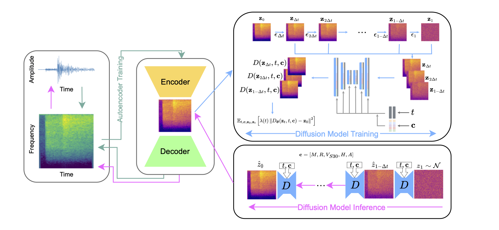

# This quake does not exist

[](https://github.com/highfem/tqdne/actions/workflows/ci.yml)
[](https://arxiv.org/abs/2410.19343)

> Generative modelling of seismic waveforms using denoising diffusion.
>
> 

## About

This repository implements Generative Waveform Models (GMWs), i.e., generative models that can generate synthetic seismic waveforms.
In particular, the repository implements *HighFEM*, the GWM introduced in [High Resolution Seismic Waveform Generation using Denoising Diffusion](https://arxiv.org/abs/2410.19343).

The repository can be also be used to replicate the results from the manuscript using the experimental code in [experiments](experiments), and for training custom GWMs from scratch.

## Quick start

If you are only interested in generating synthetic waveforms, install `tqdne` using

```bash
pip install git+https://github.com/highfem/tqdne@<RELEASE>
```

where `RELEASE` should be replaced with the latest release version to be found [here](https://github.com/highfem/tqdne/tags).
You should then be able to simulate waveforms by calling

```bash
generate-waveforms
```

from the (Unix) command line.

## Installation

If you are interested in reproducing the results from the paper, please refer to [`experiments/README.md`](experiments/README.md).

You can install `tqdne` by following the steps below.

1.
   a) **Recommended**: Download the latest [release](https://github.com/highfem/tqdne/tags) if you do not require commit history. Releases have been tested and reproduced by us and partners.

   b) Alternatively, clone the repository using:

      ```bash
      git clone (--depth 1) https://github.com/highfem/tqdne.git
      ```

2.
   There are two ways to install the package: you can either install the package with [`uv`](https://github.com/astral-sh/uv) which will use the versions of all dependencies that we are using for development, or you install the package using the `pip` installer which will install the latest versions of all dependencies.

   a) **Recommended**: Install all dependencies and the package with [`uv`](https://github.com/astral-sh/uv), via

      ```bash
      uv sync
      ```

   b) Install using `pip` install, for instance, within a `conda` or `virtualenv` environment, via:

      ```bash
      pip install -e .
      ```

## Experiments

To reproduce the experiments from the manuscript, including data preprocessing, training, and evaluation, navigate to the [experiments](./experiments) folder. Refer to the corresponding README files for step-by-step guidance.

## Sampling waveforms

You can generate your own waveforms by using the scripts in [scripts](./scripts).
See the corresponding README files for more information.

## Contributing

Contributions in the form of pull requests are more than welcome. In order to contribute:

1) Clone `tqdne` and install `uv` from [here](https://docs.astral.sh/uv/).
2) Create a new branch locally `git checkout -b feature/my-new-feature` or `git checkout -b issue/fixes-bug`.
3) Install all dependencies using: `uv sync --all-extras`.
4) Install `pre-commit` (which we use for auto-formatting and checking code) using: `pre-commit install`.
5) Implement your contribution.
6) Run `uv run ruff check .` to check the code for issues.
7) Push your changes and submit a PR 🙂.

## Acknowledgements

Some Python code has been adapted from the following repositories:

- [EDM](https://github.com/NVlabs/edm)
- [Consistency Models](https://github.com/openai/consistency_models)
