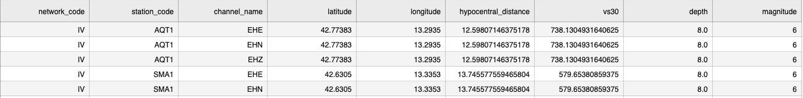

# Generate seismic waveforms

In order to generate synthetic seismic waveforms, first download the weight files from
[Zenodo](https://zenodo.org/records/15687691) and put them in the `weights` folder.

Then call

```shell
generate-waveforms
```

on the command line and follow the instructions.

## Example calls

Create 32 samples using command line arguments:

```shell
generate-waveforms \
  --hypocentral_distance 531 \
  --magnitude 6 \
  --vs30 154 \
  --hypocentre_depth 10.0 \
  --azimuthal_gap 130 \
  --num_samples 32 \
  --outfile waveforms.h5 
```

Create samples using a CSV file:

```shell
generate-waveforms \
  --csv [japan.csv | little_japan.csv] \
  --output waveforms.h5 
```

## Convert to SeisBench framework

To convert the generated `waveforms.h5` file into SeisBench format, first prepare the station metadata consisting of a list of columns in `.csv` format, similar to the following figure:



Then, run the `write_to_seisbench.py` script by:

1. Inspecting the command:

  ```shell
  python write_to_seisbench.py -h
  ```

2. Running the command:

  ```shell
  python write_to_seisbench.py \
    <path_to_station_metadata>/station_metadata.csv \
    <path_to_gwm>/waveforms.h5 \
    --origin_time "2024-02-01T00:00:00.0" \
    --hypocenter 12 10 4 \
    --magnitude 6 \
    --num_realizations 10 \
    --trace_sampling_rate 100 \
    <path_to_seisbench>/events
  ```
